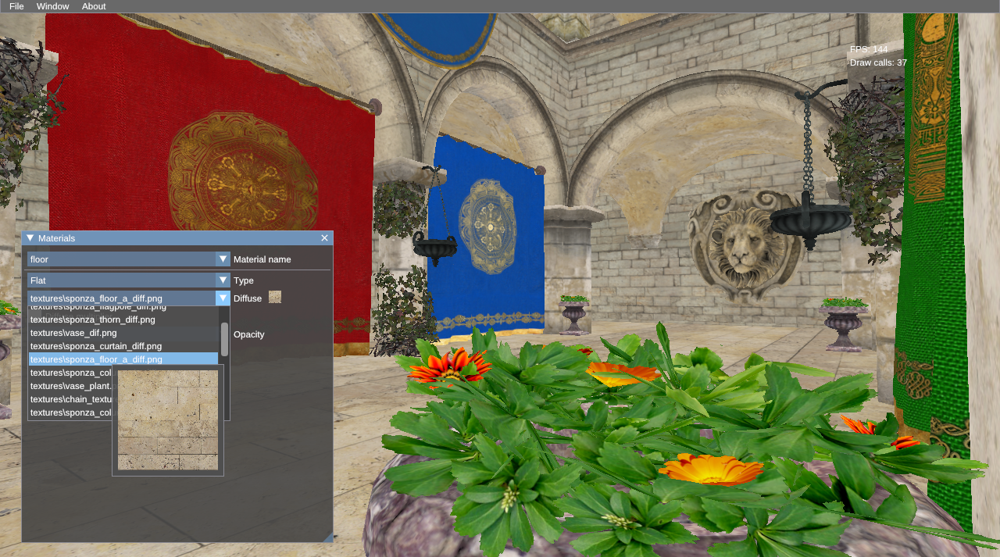

# Glaze

Trying to write an offline renderer in Rust using Vulkan.

The main idea is to have a viewport that uses normal rasterized techniques and
a component capable of rendering the physically based scene using the
Vulkan Ray Tracing API if available, or
[my previous renderer](http://github.com/davidepi/spectre-light) otherwise

Still Work In Progress

(TODO: all the shaders and the path tracing algo OMG!)

Preview of the viewport:

### Repo Structure
- *[lib](lib)*: library containing all the rendering and parsing routines.
- *[converter](converter)*: executable responsible of parsing existing 3D model files into the
custom format required by this project.
- *[app](app)*: executable that glues together *lib* and the ui.
