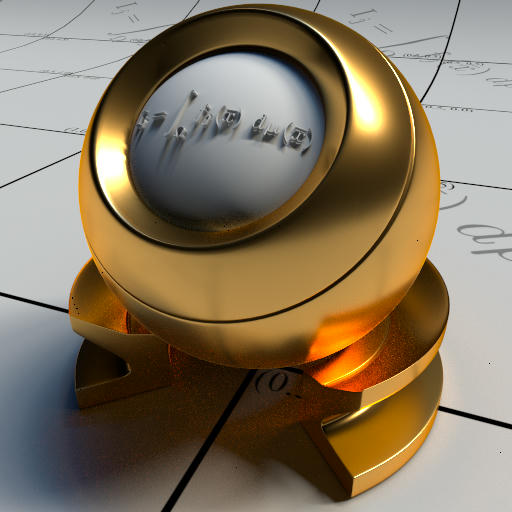

# Glaze


Realtime path tracing renderer written in Rust and Vulkan Ray Tracing.
Requires a GPU with raytracing support.


### Supported Materials

| Material type | Preview                                                      |
|---------------|--------------------------------------------------------------|
| Lambert       | |
| Glass         |   |
| Mirror        |  |
| Metal         |   |
| Pbr (GGX)     |     |

## Building and Running
### Building
_Glaze_ works on Windows and Linux operating systems.

In order to build this application [Rust](https://www.rust-lang.org/tools/install)
is required. In addition to that, [assimp](https://github.com/assimp/assimp.git)
is required to build the 3D scene converter (`glaze-converter`).

In order to build the entire suite it is sufficient to run the following command
on the project root:
```bash
cargo build --release
```
Alternatively, the following command can be used to build a single component:
```bash
cargo build --release --bin <component>
```
Where `<component>` can be one of `glaze-app`, `glaze-converter` or `glaze-cli`. 
A description of these components can be found in the section [Repo Structure](#-repo-structure)

Built binaries can be found in the folder `target/release`. 
For non-interactive executables (`glaze-converter` and `glaze-cli`, command line parameters can be retrieved with the `-h` flags.

## Repo Structure
- *[lib](lib)*: library containing all the rendering and parsing routines.
- *[converter](converter)*: executable responsible of converting existing 3D model files into the
custom format required by this project.
- *[app](app)*: executable providing an interactive application to view the rendered scene and modify lights and materials in real-time.
- [cli](cli): executable used to render a scene non-interactively. Still requires a GPU with Ray Tracing support.
